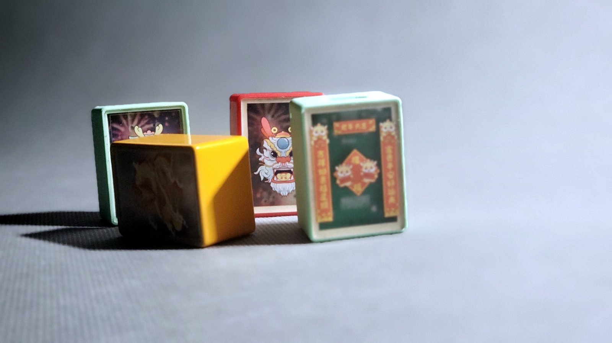
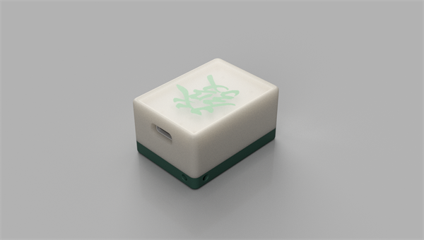
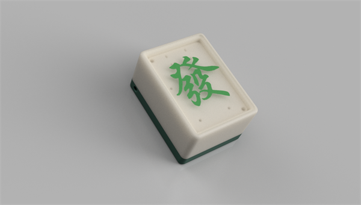

# LuckyCharm

This is a purely personal entertainment project that does not require any programming skills and can be easily acquired.

The project is inspired by mahjong and hopes to bring good luck to everyone.

Shake it and it can make celebratory or other types of sounds, which mainly depends on personal preferences.

In the meantime, you can also consider making some of them as gifts for your relatives or friends.

The overall circuit adopts the 0603 package that is easy to solder. Of course, the prerequisite is that you have a good soldering iron.

You can also find the source files [here](https://oshwhub.com/kakaka/monopoly-lucky-charms)

Connect the computer through USB type-C cable, and replace the audio files at will.

## Demo

[Video1](https://www.bilibili.com/video/BV1xm41197Ej/)
[Video2](https://www.bilibili.com/video/BV1yp421Z7Vu/)

## Battery

802025  with protective board

## Speaker

0.5W

## PCB

1.6mm

## Metal parts

|                     |        |      |
| ------------------- | ------ | ---- |
| Self-tapping screws | M1.6x8 | 2    |

## Pannel

1.0mm

If you want to replace it with your favorite picture, please modify it in the source file.

## Documents

 [help.pdf](hardware/doc/help.pdf) 

## Purchase

If you don't want to make it by yourself, you can also get the finished product here.

[Shop 1](https://gf.bilibili.com/item/detail/1105409064)
[Shop 2](https://gf.bilibili.com/item/detail/1104817057)

## License

[Creative Commons — Attribution-NonCommercial-ShareAlike 4.0 International — CC BY-NC-SA 4.0](https://creativecommons.org/licenses/by-nc-sa/4.0/)

